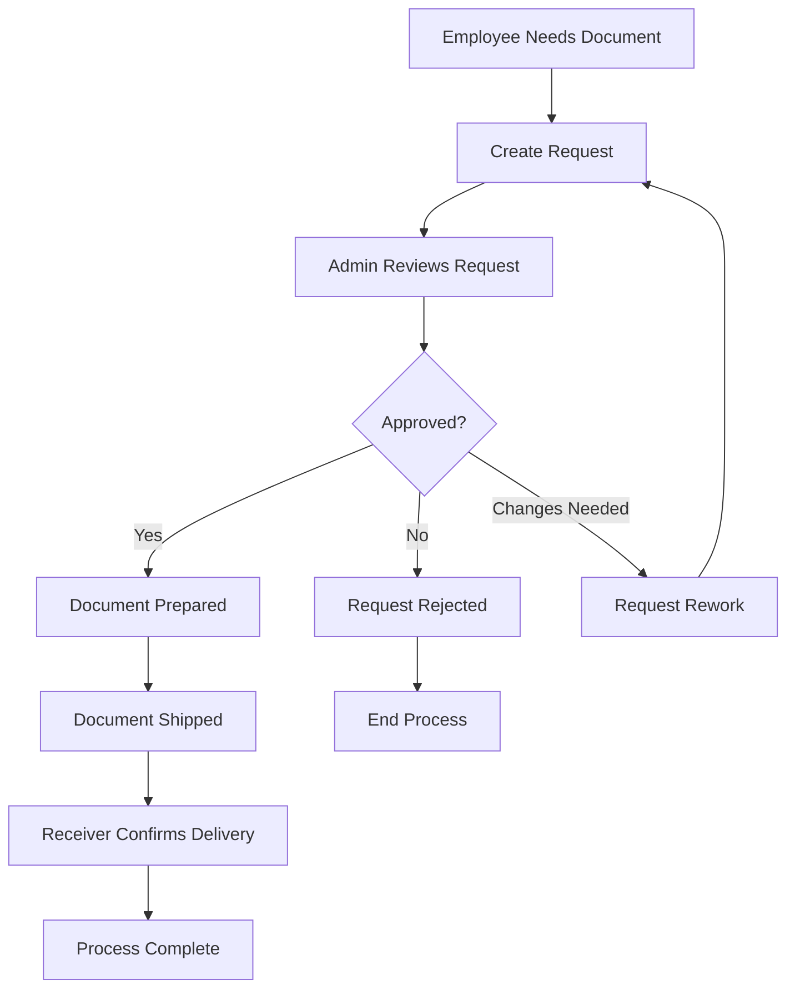
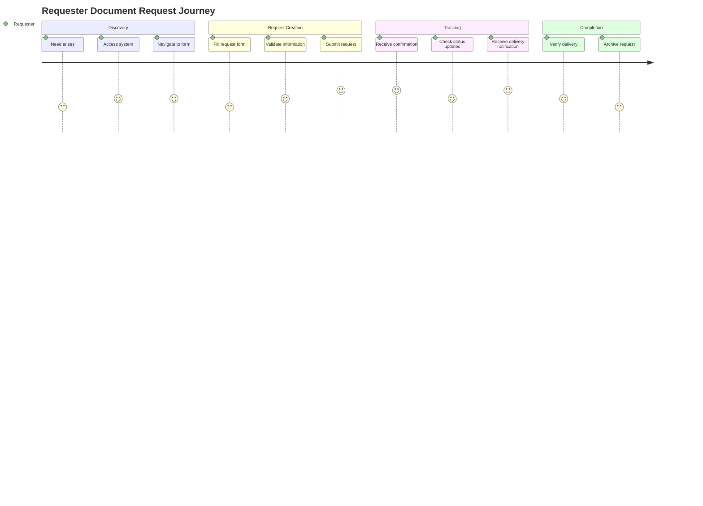

# Context Engineering Guide - Document Request Management System

## Table of Contents
1. [Overview](#overview)
2. [System Context](#system-context)
3. [Business Domain Context](#business-domain-context)
4. [Technical Context](#technical-context)
5. [User Context](#user-context)
6. [Data Context](#data-context)
7. [Integration Context](#integration-context)
8. [Operational Context](#operational-context)
9. [Security Context](#security-context)
10. [Performance Context](#performance-context)
11. [Context Templates](#context-templates)
12. [Best Practices](#best-practices)

## Overview

Context Engineering is the practice of capturing, organizing, and maintaining comprehensive system knowledge to enable effective development, maintenance, and evolution of the Document Request Management System. This guide provides frameworks and templates for understanding and working with the system's various contexts.

### Why Context Engineering Matters
- **Faster Onboarding**: New developers can understand the system quickly
- **Better Decision Making**: Informed choices based on complete context
- **Reduced Technical Debt**: Understanding prevents architectural mistakes
- **Improved Maintenance**: Clear context makes debugging and updates easier
- **Effective Communication**: Shared understanding across teams

## System Context

### High-Level System Purpose
The Document Request Management System serves as a digital workflow platform that automates and tracks the entire lifecycle of document requests within an organization. It replaces manual, paper-based processes with a streamlined digital workflow.

### Core Value Proposition
```
Problem: Manual document request processes are inefficient, error-prone, and difficult to track
Solution: Automated digital workflow with role-based access, real-time tracking, and comprehensive audit trails
Value: Reduced processing time, improved accuracy, better compliance, and enhanced user experience
```

### System Boundaries
```
Inside System Scope:
├── User authentication and authorization
├── Request creation and management
├── Approval workflows
├── Status tracking and notifications
├── Reporting and analytics
├── User management (admin functions)
└── Basic document metadata management

Outside System Scope:
├── Document content creation/editing
├── Physical document printing/scanning
├── Advanced document management (versioning, collaboration)
├── Financial processing/accounting
├── HR systems integration
└── External courier/logistics management
```

### Key System Constraints
- **Technology**: Must use React/TypeScript frontend with Supabase backend
- **Security**: Must comply with organizational data protection policies
- **Scalability**: Must support up to 1000 concurrent users
- **Availability**: 99.5% uptime requirement during business hours
- **Performance**: Page load times under 3 seconds
- **Compliance**: Must maintain audit trails for regulatory requirements

## Business Domain Context

### Organizational Workflow


### Business Rules

#### Request Creation Rules
- Requesters can only create requests for themselves or authorized recipients
- All requests must include: document name, receiver email, business justification
- Requests cannot be modified once approved unless specifically allowed
- Emergency requests can be flagged for expedited processing

#### Approval Rules
- Only FA Admin role can approve requests
- Approval requires assignment of tracking number and shipping vendor
- Rejected requests must include detailed reason
- Approved requests automatically trigger notification to receiver

#### Delivery Rules
- Only designated receiver can confirm delivery
- Delivery confirmation requires physical receipt verification
- Undelivered documents after 30 days trigger automatic follow-up
- Damaged or incorrect documents must be reported immediately

#### Access Control Rules
- Users can only see requests they created, received, or are authorized to approve
- Admin users have full system visibility except personal data restrictions
- System maintains complete audit log of all actions and access attempts

### Key Performance Indicators (KPIs)
- **Request Processing Time**: Average time from creation to approval
- **Delivery Success Rate**: Percentage of requests successfully delivered
- **User Satisfaction**: Measured through periodic surveys
- **System Availability**: Uptime percentage during business hours
- **Error Rate**: Percentage of requests requiring rework or rejection

## Technical Context

### Technology Stack Context

#### Frontend Architecture
```
React 18.3.1 Application
├── UI Layer (shadcn/ui + Tailwind CSS)
│   ├── Design System: Consistent theming and components
│   ├── Responsive Design: Mobile-first approach
│   └── Accessibility: WCAG 2.1 AA compliance
├── State Management (React Context + TanStack Query)
│   ├── Authentication State: User session and profile
│   ├── Application State: UI state and preferences
│   └── Server State: Cached API responses
├── Business Logic Layer
│   ├── Custom Hooks: Reusable business logic
│   ├── Utility Functions: Data transformation and validation
│   └── API Clients: Supabase integration wrappers
└── Routing (React Router 6)
    ├── Role-based Routes: Access control enforcement
    ├── Protected Routes: Authentication requirements
    └── Dynamic Navigation: Context-aware menus
```

#### Backend Architecture
```
Supabase Backend-as-a-Service
├── Database (PostgreSQL 15)
│   ├── Tables: Core data entities
│   ├── Views: Complex query abstractions
│   ├── Functions: Business logic in SQL
│   └── Triggers: Automated data operations
├── Authentication (Supabase Auth)
│   ├── JWT-based Sessions: Stateless authentication
│   ├── Row Level Security: Database-level authorization
│   └── Password Policies: Security enforcement
├── API Layer (PostgREST)
│   ├── RESTful Interface: CRUD operations
│   ├── RPC Functions: Complex business operations
│   └── Real-time Subscriptions: Live data updates
├── Storage (Supabase Storage)
│   ├── File Uploads: Document attachments
│   ├── Access Policies: File-level security
│   └── CDN Integration: Global content delivery
└── Edge Functions (Deno Runtime)
    ├── Email Notifications: SMTP integration
    ├── External API Calls: Third-party integrations
    └── Background Jobs: Scheduled operations
```

### Data Flow Context

#### Request Lifecycle Data Flow
```typescript
interface RequestLifecycleContext {
  // Creation Phase
  creation: {
    input: {
      requester: UserProfile;
      formData: RequestFormData;
      attachments?: File[];
    };
    validation: {
      schema: ZodSchema;
      businessRules: BusinessRule[];
      permissions: Permission[];
    };
    output: {
      request: FileRequest;
      notifications: NotificationEvent[];
      auditLog: AuditEntry;
    };
  };

  // Approval Phase
  approval: {
    input: {
      admin: UserProfile;
      request: FileRequest;
      decision: ApprovalDecision;
    };
    processing: {
      statusUpdate: StatusChange;
      trackingAssignment: TrackingInfo;
      notifications: NotificationEvent[];
    };
    output: {
      updatedRequest: FileRequest;
      deliveryInstructions: DeliveryInfo;
      auditLog: AuditEntry;
    };
  };

  // Delivery Phase
  delivery: {
    input: {
      receiver: UserProfile;
      request: FileRequest;
      confirmationData: DeliveryConfirmation;
    };
    validation: {
      receiverVerification: boolean;
      documentVerification: boolean;
    };
    output: {
      completedRequest: FileRequest;
      completionNotifications: NotificationEvent[];
      finalAuditLog: AuditEntry;
    };
  };
}
```

### Integration Points
- **Email Service**: SMTP for notifications (SendGrid/AWS SES)
- **File Storage**: Supabase Storage for document attachments
- **Authentication**: Supabase Auth with JWT tokens
- **Real-time Updates**: Supabase Realtime for live status updates
- **Analytics**: Query-based reporting within Supabase
- **Monitoring**: Built-in Supabase monitoring + external APM tools

## User Context

### User Personas

#### Requester Persona
```yaml
Name: "Sarah - Marketing Coordinator"
Demographics:
  - Age: 28-35
  - Tech Savviness: Intermediate
  - Primary Device: Laptop + Mobile
Goals:
  - Request documents quickly and efficiently
  - Track request status in real-time
  - Minimize follow-up overhead
Pain Points:
  - Unclear approval timelines
  - Lack of status visibility
  - Manual follow-up requirements
Behaviors:
  - Checks status multiple times daily
  - Prefers email notifications
  - Values mobile accessibility
Usage Patterns:
  - 3-5 requests per month
  - Peak usage: Monday mornings
  - Primary features: Create request, track status
```

#### Receiver Persona
```yaml
Name: "James - Regional Manager"
Demographics:
  - Age: 35-50
  - Tech Savviness: Basic to Intermediate
  - Primary Device: Mobile + Occasional laptop
Goals:
  - Quickly confirm document receipt
  - Ensure accurate delivery records
  - Minimal system interaction required
Pain Points:
  - Remembering to confirm receipt
  - Understanding what documents to expect
  - Mobile interface usability
Behaviors:
  - Reactive rather than proactive usage
  - Prefers simple, clear interfaces
  - Often on-the-go when using system
Usage Patterns:
  - 2-8 confirmations per month
  - Irregular usage patterns
  - Primary features: Confirm delivery, view incoming requests
```

#### Admin Persona
```yaml
Name: "Maria - FA Administrator"
Demographics:
  - Age: 30-45
  - Tech Savviness: Advanced
  - Primary Device: Desktop workstation
Goals:
  - Process requests efficiently
  - Maintain accurate records
  - Generate comprehensive reports
Pain Points:
  - High volume during peak periods
  - Complex approval decisions
  - Compliance requirements
Behaviors:
  - Systematic workflow approach
  - Values batch operations
  - Needs comprehensive data access
Usage Patterns:
  - Daily active usage (4-6 hours)
  - Peak periods: Month-end, quarter-end
  - Primary features: Approve requests, manage users, generate reports
```

### User Journey Context

#### Requester Journey


## Data Context

### Data Model Context

#### Core Entity Relationships
```typescript
interface DataModelContext {
  entities: {
    User: {
      purpose: "Authentication and basic user information";
      source: "Supabase Auth";
      lifecycle: "Managed by authentication system";
      relationships: ["Profile (1:1)", "Session (1:many)"];
    };
    
    Profile: {
      purpose: "Extended user information and role management";
      source: "Application database";
      lifecycle: "Created on first login, updated by admin";
      relationships: ["User (1:1)", "Request as requester (1:many)", "Request as receiver (1:many)"];
    };
    
    Request: {
      purpose: "Core business entity representing document requests";
      source: "Application database";
      lifecycle: "Created by requester, processed by admin, confirmed by receiver";
      relationships: ["Profile as requester (many:1)", "Profile as receiver (many:1)", "Profile as admin (many:1)"];
    };
    
    UserPath: {
      purpose: "Role-based access control configuration";
      source: "Application database";
      lifecycle: "Configured by system admin";
      relationships: ["Role definitions (implicit)"];
    };
  };
}
```

#### Data Lifecycle Context
```typescript
interface DataLifecycleContext {
  request: {
    creation: {
      trigger: "User submits request form";
      validation: ["Required fields", "Email format", "Business rules"];
      sideEffects: ["Audit log entry", "Admin notification"];
      states: ["draft", "pending"];
    };
    
    processing: {
      trigger: "Admin reviews request";
      decisions: ["approve", "reject", "request_rework"];
      validation: ["Admin permissions", "Business rules"];
      sideEffects: ["Status notifications", "Tracking assignment"];
      states: ["approved", "rejected", "rework"];
    };
    
    completion: {
      trigger: "Receiver confirms delivery";
      validation: ["Receiver identity", "Request status"];
      sideEffects: ["Completion notifications", "Final audit log"];
      states: ["completed"];
    };
    
    archival: {
      trigger: "Retention period expires";
      process: "Soft delete with audit preservation";
      compliance: "Regulatory retention requirements";
    };
  };
}
```

### Data Quality Context
- **Accuracy**: Real-time validation at input, referential integrity constraints
- **Completeness**: Required field validation, business rule enforcement
- **Consistency**: Database constraints, application-level validation
- **Timeliness**: Real-time updates, eventual consistency for notifications
- **Validity**: Schema validation, format checking, business rule compliance

## Integration Context

### External System Integration

#### Email Service Integration
```typescript
interface EmailIntegrationContext {
  provider: "Supabase Edge Functions with SMTP";
  triggers: [
    "Request created → Notify admin",
    "Request approved → Notify requester and receiver", 
    "Request rejected → Notify requester",
    "Delivery confirmed → Notify requester"
  ];
  templates: {
    requestCreated: "Admin notification with request details";
    requestApproved: "Approval notification with tracking info";
    requestRejected: "Rejection notification with reason";
    deliveryConfirmed: "Completion confirmation";
  };
  errorHandling: "Retry logic with exponential backoff";
  monitoring: "Delivery status tracking and failure alerts";
}
```

#### Authentication Integration
```typescript
interface AuthIntegrationContext {
  provider: "Supabase Auth";
  methods: ["Email/Password", "Password Reset"];
  session: {
    type: "JWT tokens";
    duration: "24 hours";
    refresh: "Automatic with 1 hour before expiry";
    storage: "Secure HTTP-only cookies";
  };
  authorization: {
    method: "Row Level Security (RLS)";
    enforcement: "Database level";
    fallback: "Application level checks";
  };
  audit: "All authentication events logged";
}
```

### API Integration Patterns

#### Internal API Context
```typescript
interface InternalAPIContext {
  pattern: "RPC-style with Supabase functions";
  
  endpoints: {
    "get_all_requests()": {
      purpose: "Fetch requests with user details";
      security: "RLS enforced";
      caching: "React Query with 5-minute stale time";
      realtime: "Subscription-based updates";
    };
    
    "create_request(params)": {
      purpose: "Create new request with validation";
      security: "User authentication + business rules";
      sideEffects: ["Audit log", "Notifications"];
      errorHandling: "Detailed validation messages";
    };
    
    "approve_request(params)": {
      purpose: "Admin approval with tracking assignment";
      security: "Admin role required";
      sideEffects: ["Status update", "Notifications", "Tracking creation"];
      idempotency: "Safe to retry";
    };
  };
  
  errorHandling: {
    strategy: "Structured error responses";
    retry: "Automatic for transient failures";
    logging: "Comprehensive error tracking";
    userFeedback: "User-friendly error messages";
  };
}
```

## Operational Context

### Deployment Context

#### Environment Strategy
```yaml
Development:
  purpose: "Local development and testing"
  database: "Local Supabase instance"
  features: "All features enabled, debug logging"
  data: "Synthetic test data"
  monitoring: "Basic console logging"

Staging:
  purpose: "Pre-production testing and demos"
  database: "Dedicated Supabase project"
  features: "Production-like configuration"
  data: "Anonymized production subset"
  monitoring: "Full monitoring stack"

Production:
  purpose: "Live system serving real users"
  database: "Production Supabase project"
  features: "Optimized for performance"
  data: "Live organizational data"
  monitoring: "Comprehensive monitoring and alerting"
```

#### Monitoring Context
```typescript
interface MonitoringContext {
  application: {
    metrics: ["Page load times", "API response times", "Error rates"];
    logging: ["User actions", "System errors", "Performance metrics"];
    alerting: ["Error rate thresholds", "Performance degradation", "System downtime"];
  };
  
  infrastructure: {
    metrics: ["Database performance", "Function execution times", "Storage usage"];
    logging: ["Database queries", "Function logs", "Security events"];
    alerting: ["Resource utilization", "Security violations", "Service outages"];
  };
  
  business: {
    metrics: ["Request volume", "Processing times", "User satisfaction"];
    reporting: ["Daily summaries", "Weekly trends", "Monthly analytics"];
    dashboards: ["Real-time metrics", "Historical trends", "Comparative analysis"];
  };
}
```

### Maintenance Context

#### Update Process
```typescript
interface MaintenanceContext {
  codeUpdates: {
    frequency: "Bi-weekly releases";
    process: "Feature branches → Staging → Production";
    rollback: "Automated rollback on critical errors";
    communication: "Advance notice for major changes";
  };
  
  databaseMigrations: {
    strategy: "Forward-only migrations";
    validation: "Staging environment testing";
    backup: "Pre-migration snapshots";
    monitoring: "Post-migration health checks";
  };
  
  securityUpdates: {
    frequency: "As needed for critical vulnerabilities";
    process: "Emergency deployment process";
    validation: "Security-focused testing";
    communication: "Post-deployment security notifications";
  };
}
```

## Security Context

### Security Model

#### Authentication Security
```typescript
interface AuthSecurityContext {
  passwordPolicy: {
    minLength: 8;
    complexity: "Mixed case, numbers, special characters";
    expiration: "90 days for admin users";
    history: "Cannot reuse last 5 passwords";
  };
  
  sessionSecurity: {
    tokenExpiry: "24 hours";
    refreshWindow: "1 hour before expiry";
    invalidation: "On password change, role change";
    monitoring: "Concurrent session detection";
  };
  
  bruteForceProtection: {
    maxAttempts: 5;
    lockoutDuration: "30 minutes";
    progressiveDelay: "Exponential backoff";
    notification: "Security alerts for admin";
  };
}
```

#### Data Security
```typescript
interface DataSecurityContext {
  encryption: {
    inTransit: "TLS 1.3 for all connections";
    atRest: "AES-256 database encryption";
    application: "Sensitive fields encrypted";
  };
  
  accessControl: {
    principle: "Least privilege";
    enforcement: "Row Level Security + Application logic";
    audit: "All data access logged";
    review: "Quarterly access reviews";
  };
  
  dataClassification: {
    public: "System configuration, public announcements";
    internal: "Request metadata, user profiles";
    confidential: "Request details, audit logs";
    restricted: "Authentication data, system secrets";
  };
}
```

### Compliance Context
- **Data Protection**: GDPR/CCPA compliance for personal data
- **Audit Requirements**: Complete audit trails for regulatory compliance
- **Access Logging**: Comprehensive logging of all system access
- **Data Retention**: Configurable retention policies by data type
- **Right to Deletion**: User data deletion capabilities

## Performance Context

### Performance Requirements

#### Response Time Context
```typescript
interface PerformanceContext {
  userExperience: {
    pageLoad: "< 3 seconds for initial load";
    navigation: "< 1 second for page transitions";
    formSubmission: "< 2 seconds for save operations";
    search: "< 1 second for search results";
  };
  
  systemCapacity: {
    concurrentUsers: "1000 simultaneous users";
    requestVolume: "10,000 requests per day";
    dataGrowth: "100GB per year";
    availability: "99.5% uptime during business hours";
  };
  
  scalability: {
    horizontal: "Auto-scaling for Edge Functions";
    vertical: "Database resource scaling";
    caching: "Multi-layer caching strategy";
    optimization: "Query optimization and indexing";
  };
}
```

#### Optimization Strategies
- **Frontend**: Code splitting, lazy loading, image optimization
- **Backend**: Database indexing, connection pooling, query optimization
- **Network**: CDN for static assets, compression, caching headers
- **User Experience**: Loading states, progressive enhancement, error boundaries

## Context Templates

### Feature Development Context Template

```typescript
interface FeatureContext {
  feature: {
    name: string;
    purpose: string;
    userStory: string;
    acceptanceCriteria: string[];
  };
  
  technical: {
    components: string[];
    dependencies: string[];
    apiChanges: string[];
    databaseChanges: string[];
  };
  
  impact: {
    userRoles: string[];
    existingFeatures: string[];
    performance: string;
    security: string;
  };
  
  testing: {
    unitTests: string[];
    integrationTests: string[];
    userAcceptanceTests: string[];
  };
  
  deployment: {
    rolloutStrategy: string;
    rollbackPlan: string;
    monitoring: string[];
    communication: string;
  };
}
```

### Bug Fix Context Template

```typescript
interface BugContext {
  issue: {
    description: string;
    reproduction: string[];
    impact: "low" | "medium" | "high" | "critical";
    affectedUsers: string[];
  };
  
  investigation: {
    rootCause: string;
    contributing: string[];
    logs: string[];
    timeline: string;
  };
  
  solution: {
    approach: string;
    alternatives: string[];
    risks: string[];
    testing: string[];
  };
  
  prevention: {
    improvements: string[];
    monitoring: string[];
    documentation: string[];
  };
}
```

## Best Practices

### Context Documentation Best Practices

#### Writing Effective Context
1. **Be Specific**: Provide concrete examples and specific details
2. **Stay Current**: Update context as the system evolves
3. **Think Multi-perspective**: Consider all stakeholder viewpoints
4. **Include Rationale**: Explain why decisions were made
5. **Link Related Context**: Create connections between related information

#### Context Maintenance
```typescript
interface ContextMaintenanceProcess {
  review: {
    frequency: "Monthly for active features";
    triggers: ["Major releases", "Architecture changes", "Performance issues"];
    owners: ["Feature owners", "Tech leads", "Product managers"];
  };
  
  updates: {
    process: "Update with code changes";
    validation: "Peer review required";
    notification: "Team communication on changes";
  };
  
  archival: {
    criteria: "Deprecated features, obsolete processes";
    process: "Move to archived section with date";
    retention: "Maintain for historical reference";
  };
}
```

#### Context Quality Metrics
- **Completeness**: All aspects of the system are documented
- **Accuracy**: Information reflects current state
- **Relevance**: Information is useful for current work
- **Accessibility**: Easy to find and understand
- **Maintainability**: Easy to keep up to date

### Using Context Effectively

#### For New Developers
1. Start with System Context for big picture
2. Dive into relevant User Context for features you'll work on
3. Study Technical Context for implementation details
4. Reference Data Context when working with database
5. Consult Security Context for any data handling

#### For Feature Development
1. Review Business Domain Context for requirements
2. Check User Context for user needs and journeys
3. Plan with Technical Context constraints in mind
4. Consider Integration Context for external dependencies
5. Plan deployment with Operational Context

#### For Troubleshooting
1. Check Operational Context for monitoring and logs
2. Review Integration Context for external service issues
3. Consult Data Context for data-related problems
4. Reference Security Context for security-related issues
5. Use Performance Context for optimization guidance

### Context Evolution

As the system grows and changes, context must evolve:

1. **Regular Reviews**: Monthly context review meetings
2. **Change Integration**: Update context with every major change
3. **Feedback Loops**: Collect feedback on context usefulness
4. **Version Control**: Track context changes alongside code changes
5. **Cross-references**: Maintain links between related context areas

This Context Engineering guide serves as a living document that should be updated as the system evolves and new context emerges. The goal is to create a comprehensive knowledge base that enables effective development, maintenance, and evolution of the Document Request Management System.