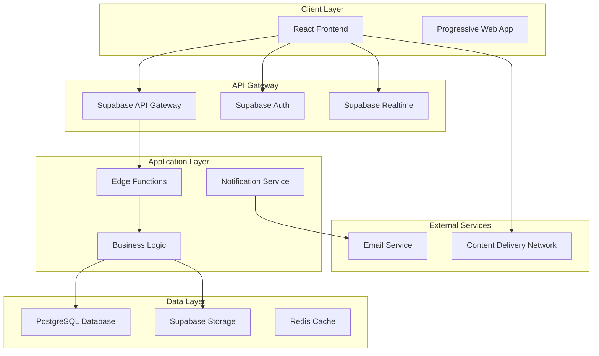
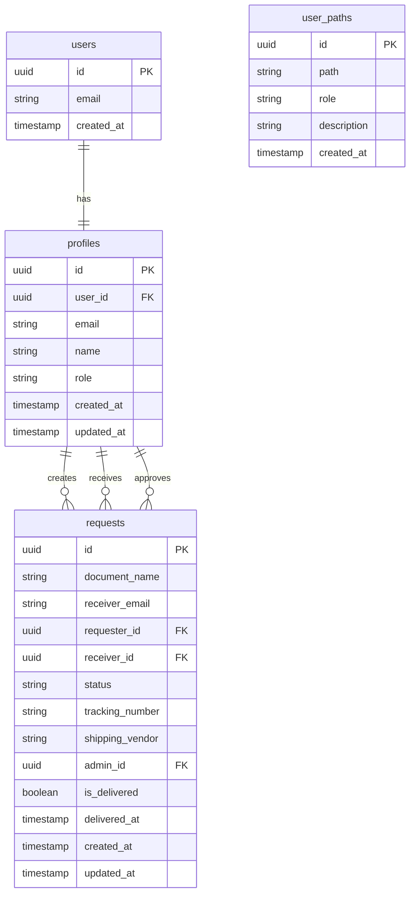
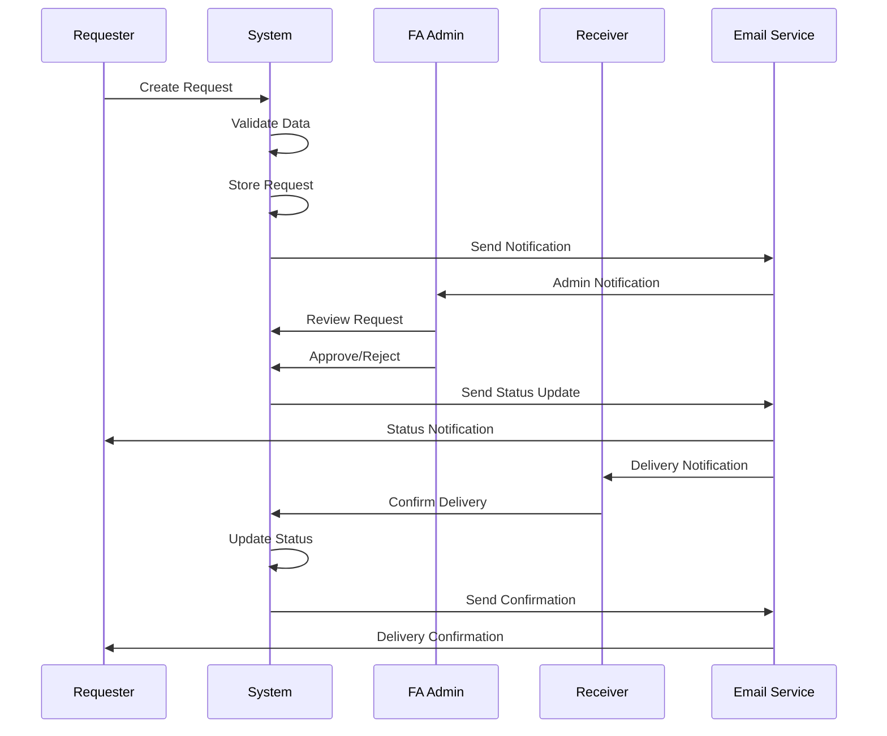
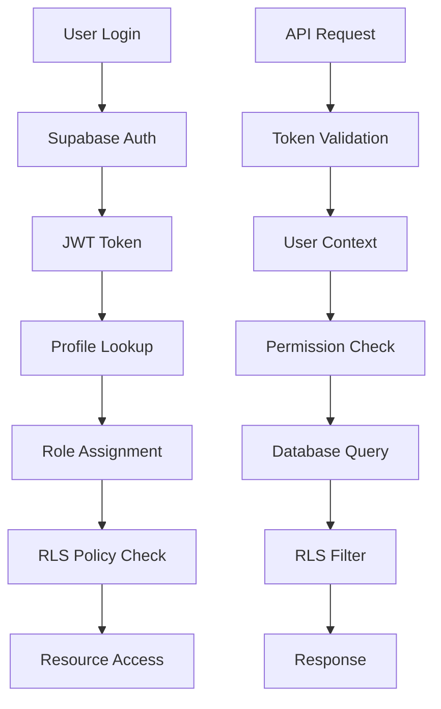
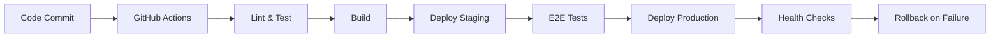

# System Architecture Documentation

## Overview
This document describes the architectural design of the Document Request Management System, including system components, data flow, security model, and integration patterns.

## Table of Contents
1. [High-Level Architecture](#high-level-architecture)
2. [Component Architecture](#component-architecture)
3. [Data Architecture](#data-architecture)
4. [Security Architecture](#security-architecture)
5. [Integration Architecture](#integration-architecture)
6. [Deployment Architecture](#deployment-architecture)
7. [Scalability Considerations](#scalability-considerations)

## High-Level Architecture



## Component Architecture

### Frontend Components

#### Core Components
```
App
├── Layout
│   ├── Navbar
│   └── Footer
├── Pages
│   ├── Dashboard (Role-specific)
│   ├── Requests
│   ├── AdminPanel
│   └── Reports
└── Components
    ├── Forms
    ├── Tables
    ├── Charts
    └── UI Components
```

#### Component Hierarchy
```typescript
// Main App Structure
App
├── AuthProvider                 // Authentication context
├── ThemeProvider               // Theme management
├── QueryProvider               // React Query setup
└── Router
    ├── PublicRoutes           // Non-authenticated routes
    └── ProtectedRoutes        // Role-based routes
        ├── AdminRoutes        // FA Admin only
        ├── RequesterRoutes    // Requester only
        └── ReceiverRoutes     // Receiver only
```

### State Management Architecture

```typescript
// Context Structure
GlobalState
├── AuthContext               // User authentication state
├── ThemeContext             // UI theme preferences
├── NotificationContext      // Toast notifications
└── DataContext              // Cached data state

// React Query Structure
QueryClient
├── Users Query              // User management
├── Requests Query           // Request data
├── Reports Query            // Analytics data
└── Settings Query           // System configuration
```

## Data Architecture

### Database Schema Design

#### Entity Relationship Diagram


### Data Flow Architecture

#### Request Lifecycle Flow


### Caching Strategy

#### Multi-Level Caching
```
Browser Cache (1 hour)
├── Static Assets
├── API Responses
└── User Preferences

React Query Cache (5 minutes)
├── User Data
├── Request Lists
└── Dashboard Metrics

Supabase Cache (30 seconds)
├── Realtime Subscriptions
├── Database Queries
└── Storage Access
```

## Security Architecture

### Authentication & Authorization Flow



### Row Level Security (RLS) Model

```sql
-- Example RLS Policies
CREATE POLICY "users_own_profile" ON profiles
  FOR ALL USING (auth.uid() = user_id);

CREATE POLICY "admin_all_access" ON requests
  FOR ALL USING (
    EXISTS (
      SELECT 1 FROM profiles 
      WHERE user_id = auth.uid() 
      AND role = 'fa_admin'
    )
  );

CREATE POLICY "requester_own_requests" ON requests
  FOR SELECT USING (
    requester_id IN (
      SELECT id FROM profiles 
      WHERE user_id = auth.uid()
    )
  );
```

### Security Layers

```
Application Security
├── Input Validation (Zod Schemas)
├── XSS Protection (React built-in)
├── CSRF Protection (SameSite cookies)
└── Content Security Policy

Database Security
├── Row Level Security (RLS)
├── SQL Injection Protection
├── Encrypted Connections (SSL)
└── Audit Logging

Infrastructure Security
├── HTTPS Enforcement
├── Security Headers
├── DDoS Protection
└── WAF (Web Application Firewall)
```

## Integration Architecture

### External Service Integration

#### Email Service Integration
```typescript
// Edge Function: send-request-notification
interface EmailNotification {
  to: string;
  template: 'request_created' | 'request_approved' | 'delivery_confirmed';
  data: {
    requestId: string;
    requesterName: string;
    documentName: string;
    trackingNumber?: string;
  };
}

// Integration Flow
Client --> Edge Function --> Email Service --> Recipient
```

#### File Storage Integration
```typescript
// Supabase Storage Structure
storage/
├── buckets/
│   ├── documents/           // Document files
│   ├── attachments/         // Request attachments
│   └── exports/            // Generated reports
└── policies/
    ├── upload_policy.sql
    ├── download_policy.sql
    └── delete_policy.sql
```

### API Integration Patterns

#### RESTful API Design
```typescript
// API Endpoints Structure
/api/v1/
├── auth/
│   ├── login
│   ├── logout
│   └── refresh
├── users/
│   ├── GET /users
│   ├── POST /users
│   ├── PUT /users/:id
│   └── DELETE /users/:id
├── requests/
│   ├── GET /requests
│   ├── POST /requests
│   ├── PUT /requests/:id
│   └── PATCH /requests/:id/status
└── reports/
    ├── GET /reports/dashboard
    ├── GET /reports/export
    └── POST /reports/generate
```

#### Real-time Updates
```typescript
// Supabase Realtime Subscriptions
const subscription = supabase
  .channel('requests')
  .on('postgres_changes', {
    event: '*',
    schema: 'public',
    table: 'requests'
  }, (payload) => {
    // Handle real-time updates
    updateRequestsCache(payload);
    showNotification(payload);
  })
  .subscribe();
```

## Deployment Architecture

### Environment Structure

```
Production Environment
├── Frontend (Vercel/Netlify)
│   ├── CDN Distribution
│   ├── SSL Termination
│   └── Edge Caching
├── Backend (Supabase)
│   ├── Database (PostgreSQL)
│   ├── Authentication Service
│   ├── Storage Service
│   └── Edge Functions
└── Monitoring
    ├── Error Tracking (Sentry)
    ├── Performance Monitoring
    └── Uptime Monitoring

Staging Environment
├── Preview Deployments
├── Testing Database
└── Integration Testing

Development Environment
├── Local Development
├── Local Supabase
└── Hot Reloading
```

### CI/CD Pipeline



## Scalability Considerations

### Horizontal Scaling

#### Database Scaling
```
Read Replicas
├── Dashboard Queries
├── Report Generation
└── Analytics

Connection Pooling
├── PgBouncer
├── Connection Limits
└── Query Optimization

Partitioning
├── Date-based Partitioning (requests)
├── User-based Partitioning (profiles)
└── Archive Strategy
```

#### Application Scaling

```
Load Balancing
├── Geographic Distribution
├── Auto-scaling Rules
└── Health Checks

Microservices Evolution
├── User Service
├── Request Service
├── Notification Service
└── Report Service

Caching Strategy
├── CDN for Static Assets
├── Redis for Session Data
├── Application-level Caching
└── Database Query Caching
```

### Performance Optimization

#### Frontend Optimization
```typescript
// Code Splitting
const AdminDashboard = lazy(() => import('./pages/AdminDashboard'));
const RequesterDashboard = lazy(() => import('./pages/RequesterDashboard'));

// Bundle Analysis
{
  "analyze": "npm run build && npx webpack-bundle-analyzer dist/static/js/*.js"
}

// Resource Hints
<link rel="preload" href="/api/user" as="fetch" crossorigin>
<link rel="prefetch" href="/dashboard" as="document">
```

#### Backend Optimization
```sql
-- Index Optimization
CREATE INDEX idx_requests_status ON requests(status);
CREATE INDEX idx_requests_requester ON requests(requester_id);
CREATE INDEX idx_requests_created_at ON requests(created_at DESC);

-- Query Optimization
EXPLAIN (ANALYZE, BUFFERS) 
SELECT * FROM get_all_requests();
```

### Monitoring & Observability

#### Application Monitoring
```typescript
// Error Tracking
import * as Sentry from '@sentry/react';

Sentry.init({
  dsn: 'YOUR_SENTRY_DSN',
  integrations: [
    new BrowserTracing(),
  ],
  tracesSampleRate: 1.0,
});

// Performance Monitoring
const performance = {
  api: new PerformanceObserver(),
  render: new PerformanceObserver(),
  navigation: new PerformanceObserver()
};
```

#### Database Monitoring
```sql
-- Performance Monitoring Views
CREATE VIEW request_performance AS
SELECT 
  query,
  calls,
  total_time,
  mean_time,
  rows
FROM pg_stat_statements 
ORDER BY total_time DESC;
```

This architecture supports current requirements while providing a foundation for future growth and scalability needs.